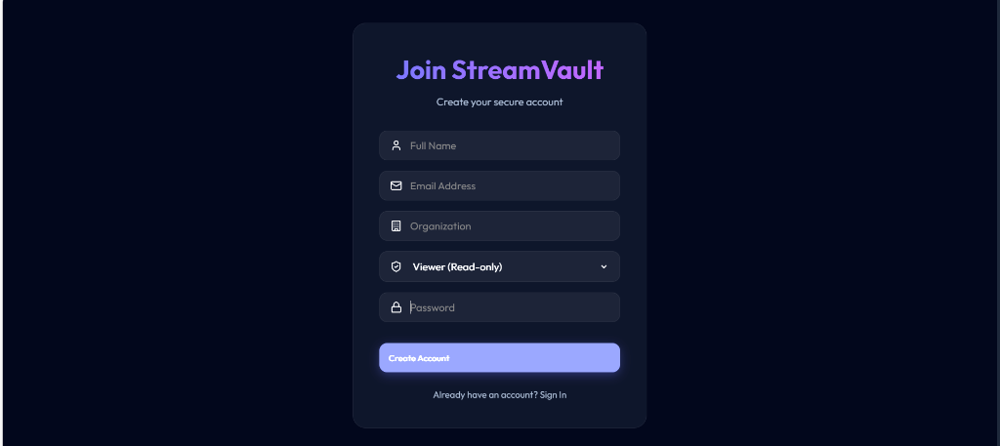

# StreamVault | Secure Video Management & Streaming

StreamVault is a premium, industrial-grade full-stack application for secure video management. It features automated sensitivity analysis, real-time processing updates via WebSockets, and seamless streaming with HTTP range requests.

## 🌐 Live Deployment

- **Frontend (Production)**: [https://video-valut.vercel.app](https://video-valut.vercel.app)
- **Backend (API Service)**: [https://video-valut.onrender.com](https://video-valut.onrender.com)

## 📸 Screenshots



## 🛠 Tech Stack

- **Frontend**: React 19, Vite, Framer Motion (Animations), Lucide React (Icons), Socket.io-client.
- **Backend**: Node.js, Express, MongoDB (Atlas), Socket.io, Multer, FFmpeg (Video Processing).
- **Deployment**: Vercel (Frontend), Render (Backend).

## 🚀 Installation & Setup

### Prerequisites
- **Node.js**: v18.x or higher
- **MongoDB**: A local instance or a MongoDB Atlas connection string
- **FFmpeg**: Required for server-side video transcoding (optional for demo mode)

### 1. Backend Configuration
```bash
cd server
npm install
```
Create a `.env` file in the `server` directory:
```env
PORT=5000
MONGODB_URI=your_mongodb_connection_string
JWT_SECRET=your_secure_random_secret
CORS_ORIGIN=https://video-valut.vercel.app
```

### 2. Frontend Configuration
```bash
cd client
npm install
```
The frontend is configured to proxy API requests in production. For local development, ensure the backend is running on port 5000.

### 3. Running Locally
**Start Backend:**
```bash
cd server
npm start
```
**Start Frontend:**
```bash
cd client
npm run dev
```

## 🎥 Core Features

1. **Secure Ingestion**: Multipart uploads with size validation and organization-based isolation.
2. **Real-Time Analysis**: Background video processing with live status updates via WebSockets.
3. **Sensitivity Guard**: Automated scanning (mocked) to flag assets as 'Safe' or 'Flagged'.
4. **Range-Request Streaming**: Efficient bandwidth usage and high-performance seeking.
5. **RBAC Security**: Role-based access (Viewer, Editor, Admin) ensuring total data segregation.

---
Developed for the Full-Stack Engineering Assignment.
